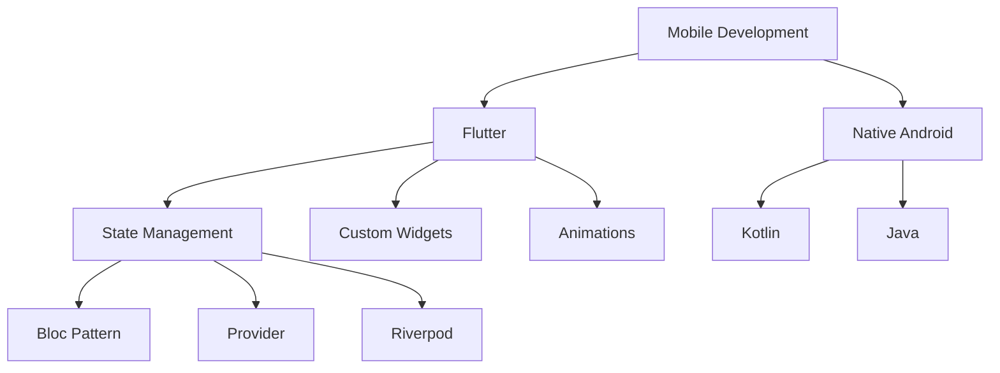

<div align="center">
  
# Hi there, I'm Udai Senevirathne 👋

[](https://git.io/typing-svg)

[](https://linkedin.com/in/Udai-Senevirathne)
[](mailto:udaisenevirathne@gmail.com)
[](https://github.com/Udai-Senevirathne)

</div>

---

## 🚀 About Me

```dart
class Developer {
  final String name = "Udai Senevirathne";
  final String role = "Software Engineering Undergraduate";
  final String location = "Sri Lanka 🇱🇰";
  final String institution = "National Institute of Business Management";
  
  List<String> expertise = [
    "Mobile App Development",
    "Full Stack Web Development", 
    "UI/UX Design",
    "Database Architecture"
  ];
  
  Map<String, List<String>> currentlyWorking = {
    "Mobile": ["Flutter", "Cross-platform apps", "State management"],
    "Backend": ["Spring Boot", "RESTful APIs", "Microservices"],
    "Frontend": ["React", "Modern JavaScript", "Responsive design"],
    "Learning": ["Cloud architecture", "DevOps", "AI integration"]
  };
  
  String motto = "Building the future, one line of code at a time";
}
```

---

## 🛠️ Tech Stack

<div align="center">

### 📱 Mobile Development


### 🌐 Web Development


### ⚙️ Backend & Languages


### 🗄️ Databases & Tools


### 🧰 Development Tools


</div>

---

## 🎯 Current Focus & Projects

<table>
<tr>
<td width="50%">

### 📱 Mobile Development
- **Flutter** cross-platform applications
- **State management** with Bloc/Provider
- **Custom UI components** and animations
- **Firebase integration** and real-time features
- **App store deployment** and CI/CD

</td>
<td width="50%">

### 🌐 Full Stack Development
- **RESTful APIs** with Spring Boot
- **React** frontend with modern hooks
- **Database design** and optimization
- **Authentication** and security implementation
- **Microservices** architecture

</td>
</tr>
</table>

### 🚧 Currently Building
```yaml
Mobile Apps:
  - E-commerce platform with Flutter
  - Real-time chat application
  - Task management system with offline sync

Web Applications:
  - Portfolio management dashboard
  - Learning management system
  - API-first content management platform

Learning & Exploring:
  - Cloud deployment (AWS/Firebase)
  - Advanced Flutter animations
  - GraphQL and modern API design
```

---

## 🏆 Professional Highlights

<div align="center">

| 🎓 **Education** | 💼 **Development** | 🌟 **Specialization** |
|:---:|:---:|:---:|
| Software Engineering | Mobile-First Approach | Cross-Platform Development |
| NIBM Institute | Full Stack Solutions | UI/UX Implementation |
| Modern Methodologies | Clean Architecture | Performance Optimization |

</div>

### 📈 Development Approach
- **Mobile-first** design philosophy
- **Clean architecture** and SOLID principles
- **Test-driven development** practices
- **Agile methodologies** and sprint planning
- **Version control** with Git workflows

---

## 🎨 UI/UX & Design Skills

<div align="center">


**Design Principles:**
- Material Design & Human Interface Guidelines
- Responsive and adaptive layouts
- Accessibility-first approach
- User-centered design thinking

</div>

---

## 📱 Mobile Development Expertise

<div align="center">



</div>

**Key Mobile Technologies:**
- **Flutter Framework** - Cross-platform development
- **Dart Language** - Modern, efficient programming
- **State Management** - Bloc, Provider, Riverpod
- **Native Integration** - Platform channels and plugins
- **Performance** - Optimization and profiling

---

## 🌐 Connect & Collaborate

<div align="center">

**Let's build something amazing together!**

[](https://github.com/Udai-Senevirathne)
[](https://linkedin.com/in/Udai-Senevirathne)
[](mailto:udaisenevirathne@gmail.com)
[](https://github.com/Udai-Senevirathne)

</div>

<div align="center">
  
</div>

---

<div align="center">
  
**"Code is like humor. When you have to explain it, it's bad."** – Cory House

*Building the future through innovative mobile and web solutions* 🚀

</div>
