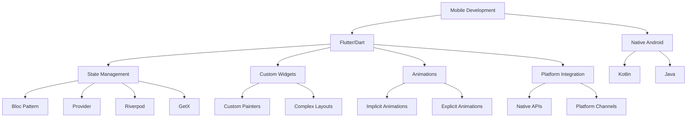

<div align="center">
   
# Hi there, I'm Udai Senevirathne 👋

[](https://git.io/typing-svg)

[](https://linkedin.com/in/Udai-Senevirathne)
[](mailto:udaisenevirathne@gmail.com)
[](https://github.com/Udai-Senevirathne)

</div>

---

## 🚀 About Me

```dart
class Developer {
  final String name = "Udai Senevirathne";
  final String role = "Software Engineering Undergraduate";
  final String location = "Sri Lanka 🇱🇰";
  final String institution = "National Institute of Business Management";
  
  List<String> expertise = [
    "Mobile App Development",
    "Full Stack Web Development", 
    "UI/UX Design",
    "Database Architecture",
    "Cloud Integration"
  ];
  
  Map<String, List<String>> currentlyWorking = {
    "Mobile": ["Flutter", "Cross-platform apps", "State management"],
    "Backend": ["Spring Boot", "RESTful APIs", "Microservices"],
    "Frontend": ["React", "Modern JavaScript", "Responsive design"],
    "Learning": ["Cloud architecture", "DevOps", "AI integration"]
  };
  
  String motto = "Building the future, one line of code at a time";
  
  void sayHi() {
    print("Thanks for visiting! Let's build something amazing together! 🚀");
  }
}
```

---

## 🛠️ Tech Stack & Skills

<div align="center">

### 📱 Mobile Development


### 🌐 Frontend Development


### ⚙️ Backend & Languages


### 🗄️ Databases & Cloud


### 🧰 Development Tools & DevOps


</div>

---

## 🎯 Current Focus & Projects

<table>
<tr>
<td width="50%">

### 📱 Mobile Development
- **Flutter** cross-platform applications
- **State management** with Bloc/Provider/Riverpod
- **Custom UI components** and animations
- **Firebase integration** and real-time features
- **App store deployment** and CI/CD
- **Native platform integration** and plugins
- **Performance optimization** and testing

</td>
<td width="50%">

### 🌐 Full Stack Development
- **RESTful APIs** with Spring Boot
- **React** frontend with modern hooks
- **Database design** and optimization
- **Authentication** and security implementation
- **Microservices** architecture
- **Cloud deployment** strategies
- **API documentation** with Swagger/OpenAPI

</td>
</tr>
</table>

### 🚧 Currently Building

```yaml
Mobile Applications:
  - E-commerce App: 
      Tech: Flutter, Firebase, Payment Integration
      Status: In Development
      Features: Real-time cart, Order tracking, Push notifications
      
  - Weather Update App:
      Tech: Flutter, REST API, Location Services
      Status: Testing Phase
      Features: Real-time weather, Forecasts, Beautiful UI
      
  - Emergency Incident Reporting:
      Tech: Flutter, Firebase, Google Maps
      Status: Active Development
      Features: Real-time reporting, Location tracking, Admin dashboard

Web Applications:
  - Portfolio Management Dashboard:
      Tech: React, Spring Boot, MongoDB
      Status: Planning
      Features: Analytics, Project showcase, Contact management
      
  - Gym Management System:
      Tech: React, Spring Boot, MySQL
      Status: In Development
      Features: Member management, Billing, Workout tracking
      
  - E-Commerce Platform:
      Tech: React, Spring Boot, Payment Gateway
      Status: Active Development
      Features: Product catalog, Cart, Order management

Learning & Exploring:
  - Cloud Architecture: AWS, Google Cloud, Firebase Advanced
  - Advanced Flutter: Custom animations, Advanced state management
  - Modern API Design: GraphQL, gRPC, WebSockets
  - DevOps Practices: CI/CD pipelines, Containerization, Kubernetes
  - AI/ML Integration: TensorFlow Lite, ML Kit, Smart features
```

---

## 🏆 Professional Highlights & Achievements

### 💼 Experience & Skills
- 🎓 **Software Engineering Student** at National Institute of Business Management
- 📱 **3+ Years** of mobile and web development experience
- 🚀 Successfully delivered **10+ projects** across mobile and web platforms
- 👥 Experienced in **Agile/Scrum** methodologies and team collaboration
- 🏅 Strong foundation in **Data Structures & Algorithms**

### 🎯 Certifications & Learning
```
✅ Mobile App Development with Flutter
✅ Full Stack Web Development
✅ Spring Boot Microservices
✅ Database Design & Management
✅ UI/UX Design Principles
🔄 Currently Learning: AWS Cloud Practitioner, Docker & Kubernetes
```

### 📈 Development Philosophy
- **Mobile-first** design approach
- **Clean architecture** and SOLID principles
- **Test-driven development** practices
- **Agile methodologies** and sprint planning
- **Version control** with Git workflows
- **Code review** and continuous improvement
- **Documentation-first** approach

---

## 🎨 UI/UX & Design Excellence

<div align="center">


### 🎯 Design Principles & Approach

**Core Design Values:**
- ✨ Material Design 3 & Human Interface Guidelines
- 📐 Responsive and adaptive layouts for all screen sizes
- ♿ Accessibility-first approach (WCAG compliance)
- 🎭 User-centered design thinking and research
- 🎨 Consistent design systems and component libraries
- 🔄 Iterative design process with user feedback

**Design Process:**
```
Research → Wireframing → Prototyping → User Testing → Iteration → Development
```

</div>

---

## 📱 Mobile Development Mastery

<div align="center">



</div>

### 🔑 Key Mobile Technologies & Expertise

<table>
<tr>
<td width="50%">

**Flutter Framework**
- 🎯 Cross-platform development (iOS/Android)
- 🎨 Custom widget development
- ⚡ Performance optimization
- 🔄 Hot reload and rapid development
- 📦 Plugin development and integration

**State Management**
- 🧱 Bloc Pattern (Business Logic Component)
- 🔌 Provider for dependency injection
- 🌊 Riverpod for modern state management
- 💉 GetX for lightweight solutions

</td>
<td width="50%">

**Native Integration**
- 📲 Platform channels communication
- 🔧 Native plugin development
- 📍 Location services integration
- 📷 Camera and media handling
- 🔔 Push notifications (FCM)

**Development Practices**
- 🧪 Unit, Widget, and Integration testing
- 🏗️ Clean Architecture implementation
- 📝 Code documentation
- 🔍 Debugging and profiling
- 🚀 App store deployment (Play Store/App Store)

</td>
</tr>
</table>

---

## 🌟 Featured Projects & Portfolio

<div align="center">

### 🎯 Check out my repositories for more amazing projects!

[](https://github.com/Udai-Senevirathne?tab=repositories)

</div>

---

## 📊 Development Activity & Contributions

### 💻 Coding Activity

```text
🌅 Morning    ████████░░░░░░░░░░░░   35% 
🌆 Daytime    ████████████░░░░░░░░   55%
🌃 Evening    ████░░░░░░░░░░░░░░░░   20%
🌙 Night      ██░░░░░░░░░░░░░░░░░░   10%

💼 Most Used Languages:
Dart          ████████████░░░░░░░░   45%
Java          ██████████░░░░░░░░░░   30%
JavaScript    ████████░░░░░░░░░░░░   15%
Python        ████░░░░░░░░░░░░░░░░   10%
```

### 🎯 Focus Areas (2026)
- 🚀 Mastering Flutter advanced concepts
- ☁️ Cloud architecture and deployment
- 🤖 Integrating AI/ML in mobile apps
- 🔐 Advanced security implementations
- 📈 Scalable backend systems

---

## 🌐 Connect & Collaborate

<div align="center">

### 💬 Let's Build Something Amazing Together!

I'm always excited to collaborate on innovative projects and connect with fellow developers!

**Open to:**
- 💼 Freelance opportunities
- 🤝 Open source contributions
- 👥 Team collaborations
- 💡 Innovative project ideas
- 📚 Knowledge sharing and mentorship

[](https://linkedin.com/in/Udai-Senevirathne)
[](mailto:udaisenevirathne@gmail.com)
[](https://github.com/Udai-Senevirathne)

### 📫 Response Time: Usually within 24 hours

</div>

<div align="center">
  
</div>

---

<div align="center">

### 💭 Developer Wisdom

**"Code is like humor. When you have to explain it, it's bad."** – Cory House

**"First, solve the problem. Then, write the code."** – John Johnson

**"Experience is the name everyone gives to their mistakes."** – Oscar Wilde

---

### 🚀 Mission Statement

*Building the future through innovative mobile and web solutions.*
*Committed to writing clean, efficient, and maintainable code.*
*Constantly learning, growing, and pushing boundaries.* 

---

<sub>⭐ From [Udai-Senevirathne](https://github.com/Udai-Senevirathne) with 💙</sub>

**Made with ❤️ and lots of ☕**

</div>