# 👋 Hello, I'm Udai Senevirathne!

  

---

## 🚀 About Me

I'm a passionate **Full Stack Developer** specializing in **Mobile** and **Web Development**. With expertise in both frontend and backend technologies, I create seamless, scalable, and user-centric applications. Currently pursuing my degree in **Software Engineering** at **SLIIT** while working on innovative projects.

- 🎓 **Software Engineering Undergraduate** at SLIIT
- 💼 **Mobile & Web Developer** with hands-on project experience
- 🌱 Currently mastering **Advanced Flutter**, **Spring Boot Microservices**, and **Cloud Architecture**
- 🎯 Goal: Build impactful applications that solve real-world problems
- ⚡ Fun fact: I love exploring new technologies and contributing to open-source!

---

## 💻 Tech Stack

### 📱 Mobile Development

### 🌐 Frontend Development

### ⚙️ Backend Development

### 🗄️ Databases

### ☁️ Cloud & Services

### 🛠️ Tools & Technologies

---

## 📊 GitHub Stats

  

---

## 🏆 GitHub Trophies

---

## 🔥 Contribution Graph

---

## 📈 Contribution Stats

---

## 🏗️ Full Stack Development Mastery

```mermaid
graph TD
    A[Full Stack Development] --> B[Mobile Development]
    A --> C[Frontend Development]
    A --> D[Backend Development]
    A --> E[Database & Cloud]
    A --> F[DevOps & Tools]
    
    B --> B1[Flutter/Dart]
    B --> B2[Native Android]
    B --> B3[iOS Development]
    
    B1 --> B1a[State Management]
    B1 --> B1b[Custom Widgets]
    B1 --> B1c[Animations]
    B1 --> B1d[Platform Integration]
    
    B1a --> B1a1[Bloc Pattern]
    B1a --> B1a2[Provider]
    B1a --> B1a3[Riverpod]
    B1a --> B1a4[GetX]
    
    B2 --> B2a[Kotlin]
    B2 --> B2b[Java]
    B2 --> B2c[Android SDK]
    
    C --> C1[React]
    C --> C2[JavaScript/TypeScript]
    C --> C3[HTML5/CSS3]
    C --> C4[UI Frameworks]
    
    C1 --> C1a[Hooks]
    C1 --> C1b[Context API]
    C1 --> C1c[Redux]
    
    C4 --> C4a[Tailwind CSS]
    C4 --> C4b[Bootstrap]
    C4 --> C4c[Material-UI]
    
    D --> D1[Spring Boot]
    D --> D2[Node.js]
    D --> D3[Python]
    D --> D4[PHP]
    
    D1 --> D1a[REST APIs]
    D1 --> D1b[Microservices]
    D1 --> D1c[Spring Security]
    D1 --> D1d[JPA/Hibernate]
    
    E --> E1[SQL Databases]
    E --> E2[NoSQL Databases]
    E --> E3[Cloud Services]
    
    E1 --> E1a[MySQL]
    E1 --> E1b[PostgreSQL]
    E1 --> E1c[Oracle]
    E1 --> E1d[SQLite]
    
    E2 --> E2a[MongoDB]
    E2 --> E2b[Firebase]
    
    E3 --> E3a[Firebase Cloud]
    E3 --> E3b[AWS]
    E3 --> E3c[Google Cloud]
    
    F --> F1[Version Control]
    F --> F2[IDEs & Editors]
    F --> F3[Design Tools]
    F --> F4[Testing & API]
    F --> F5[Containerization]
    
    F1 --> F1a[Git]
    F1 --> F1b[GitHub]
    
    F2 --> F2a[VS Code]
    F2 --> F2b[Android Studio]
    F2 --> F2c[IntelliJ IDEA]
    
    F3 --> F3a[Figma]
    F3 --> F3b[Adobe XD]
    F3 --> F3c[FlutterFlow]
    
    F4 --> F4a[Postman]
    F4 --> F4b[JUnit]
    F4 --> F4c[Jest]
    
    F5 --> F5a[Docker]
    
    style A fill:#2D63FF,stroke:#1a3d99,color:#fff
    style B fill:#02569B,stroke:#014578,color:#fff
    style C fill:#61DAFB,stroke:#4ab8d4,color:#000
    style D fill:#6DB33F,stroke:#578f32,color:#fff
    style E fill:#4EA94B,stroke:#3d8539,color:#fff
    style F fill:#F05032,stroke:#c93e26,color:#fff
```

### 🔑 Comprehensive Technology Stack

<table>
<tr>
<td width="33%">

**📱 Mobile Development**
- 🎯 **Flutter & Dart**
  - Cross-platform apps
  - State management (Bloc, Provider, Riverpod, GetX)
  - Custom widgets & animations
  - Platform channels
  - Hot reload development
  
- 📲 **Native Android**
  - Kotlin & Java
  - Android SDK & Jetpack
  - Material Design
  - Activity/Fragment lifecycle
  
- 🍎 **iOS Development**
  - Flutter iOS deployment
  - Platform-specific features
  - App Store guidelines

</td>
<td width="33%">

**🌐 Frontend Development**
- ⚛️ **React Ecosystem**
  - Modern React hooks
  - Component architecture
  - State management
  - Context API & Redux
  
- 💻 **Web Technologies**
  - JavaScript ES6+
  - TypeScript
  - HTML5 & CSS3
  - Responsive design
  
- 🎨 **UI Frameworks**
  - Tailwind CSS
  - Bootstrap
  - Material-UI
  - Vite bundler

</td>
<td width="33%">

**⚙️ Backend Development**
- ☕ **Java & Spring Boot**
  - RESTful APIs
  - Microservices
  - Spring Security
  - JPA/Hibernate ORM
  
- 🐍 **Multi-language**
  - Python scripting
  - Node.js runtime
  - PHP web development
  - C# applications
  
- 🔐 **Backend Features**
  - Authentication & Authorization
  - API documentation
  - Error handling
  - Logging & monitoring

</td>
</tr>
<tr>
<td width="33%">

**🗄️ Database Management**
- 📊 **SQL Databases**
  - MySQL
  - PostgreSQL
  - Oracle Database
  - SQLite
  
- 📦 **NoSQL Solutions**
  - MongoDB
  - Firebase Realtime DB
  - Firestore
  
- 🔍 **Database Skills**
  - Schema design
  - Query optimization
  - Indexing strategies
  - Migrations

</td>
<td width="33%">

**☁️ Cloud & Services**
- 🔥 **Firebase**
  - Authentication
  - Cloud Firestore
  - Cloud Functions
  - Cloud Storage
  - FCM Push Notifications
  
- ☁️ **Cloud Platforms**
  - AWS services
  - Google Cloud Platform
  - Hosting & deployment
  
- 🌐 **Integration**
  - Third-party APIs
  - Payment gateways
  - Maps & location services

</td>
<td width="33%">

**🛠️ DevOps & Tools**
- 🔧 **Version Control**
  - Git workflows
  - GitHub Actions
  - Branch strategies
  
- 💼 **Development Tools**
  - VS Code
  - Android Studio
  - IntelliJ IDEA
  - Postman API testing
  
- 🎨 **Design Tools**
  - Figma prototyping
  - Adobe XD
  - FlutterFlow
  
- 🐳 **Containerization**
  - Docker basics
  - Container deployment

</td>
</tr>
</table>

### 🎯 Development Practices & Methodologies

| Category | Technologies & Practices |
|----------|-------------------------|
| **🏗️ Architecture** | Clean Architecture, MVVM, MVC, Repository Pattern, Dependency Injection |
| **🧪 Testing** | Unit Testing, Widget Testing, Integration Testing, JUnit, Jest, Test Coverage |
| **📝 Documentation** | README files, API Documentation, Code Comments, Swagger/OpenAPI |
| **🔄 Version Control** | Git, GitHub, Pull Requests, Code Reviews, Branch Management |
| **🚀 CI/CD** | GitHub Actions, Automated Testing, Build Automation, Deployment Pipelines |
| **📊 Project Management** | Agile/Scrum, Jira, Sprint Planning, Task Tracking |
| **🔐 Security** | Authentication, Authorization, Data Encryption, Secure APIs, OWASP Guidelines |
| **⚡ Performance** | Code Optimization, Lazy Loading, Caching, Performance Profiling |

---

## 🌟 Featured Projects

### 🚗 [Vehicle Management System](https://github.com/Udai-Senevirathne/vehicle-management-system)
> **Full Stack Mobile & Web Application**

A comprehensive vehicle management solution built with modern technologies:
- **Frontend**: React + Vite + TailwindCSS
- **Mobile**: Flutter with advanced state management
- **Backend**: Spring Boot REST APIs
- **Database**: MySQL with optimized queries
- **Features**: 
  - Real-time vehicle tracking
  - Maintenance scheduling
  - User authentication & authorization
  - Responsive design across all devices
  - Admin dashboard with analytics

---

### 📱 [Mobile Point of Sale System](https://github.com/Udai-Senevirathne/pos-system)
> **Flutter Mobile Application**

Modern POS system designed for retail businesses:
- Beautiful UI with custom animations
- Offline-first architecture with Firebase sync
- Inventory management
- Sales analytics and reporting
- Receipt generation and printing
- Multi-user support with role-based access
- **Tech**: Flutter, Dart, Firebase, Provider

---

### 🌐 [Portfolio Website](https://github.com/Udai-Senevirathne/portfolio)
> **React Web Application**

Personal portfolio showcasing projects and skills:
- Modern, responsive design
- Smooth animations and transitions
- Dark/Light theme toggle
- Interactive project gallery
- Contact form with email integration
- **Tech**: React, TypeScript, TailwindCSS, Framer Motion

---

## 🎓 Education & Certifications

| 🎓 Degree/Certification | 🏛️ Institution | 📅 Year |
|-------------------------|----------------|---------|
| **BSc (Hons) in Software Engineering** | NIBM - National Institute of Business Management | 2023 - Present |
| **Advanced Flutter Development** | Udemy | 2024 |
| **Software Engineer** | Hackerrank | 2024 |
| **React - The Complete Guide** | Udemy | 2023 |

---

## 💼 What I'm Currently Working On

- 🔨 Building a **comprehensive full-stack e-commerce platform** with Flutter, React, and Spring Boot
- 📚 Learning **Kubernetes** and **advanced cloud architectures**
- 🎯 Contributing to **open-source Flutter packages**
- 🌱 Exploring **AI/ML integration** in mobile applications
- 📝 Writing technical blogs about **mobile development best practices**

---

## 🤝 Let's Connect!

---

## 💭 Quote of the Day

### 💙 Thanks for visiting my profile! Let's build something amazing together! 🚀

